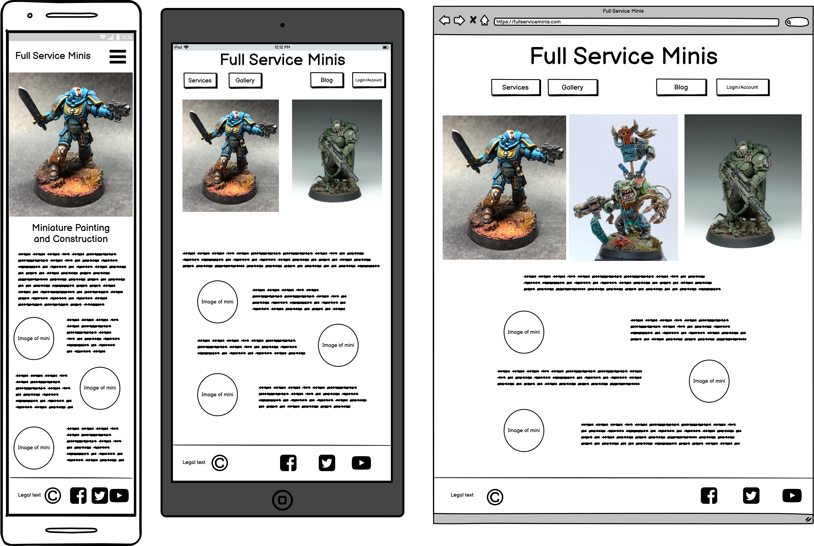
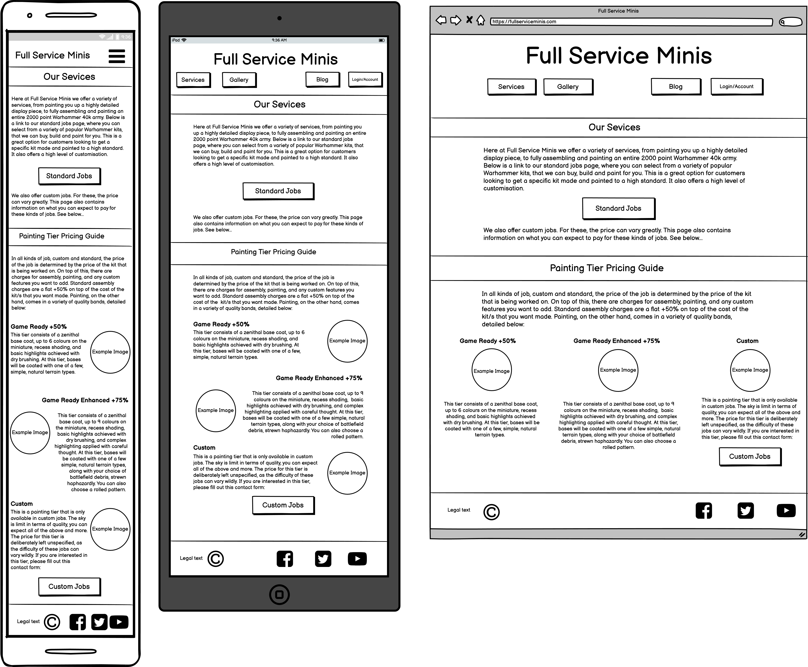
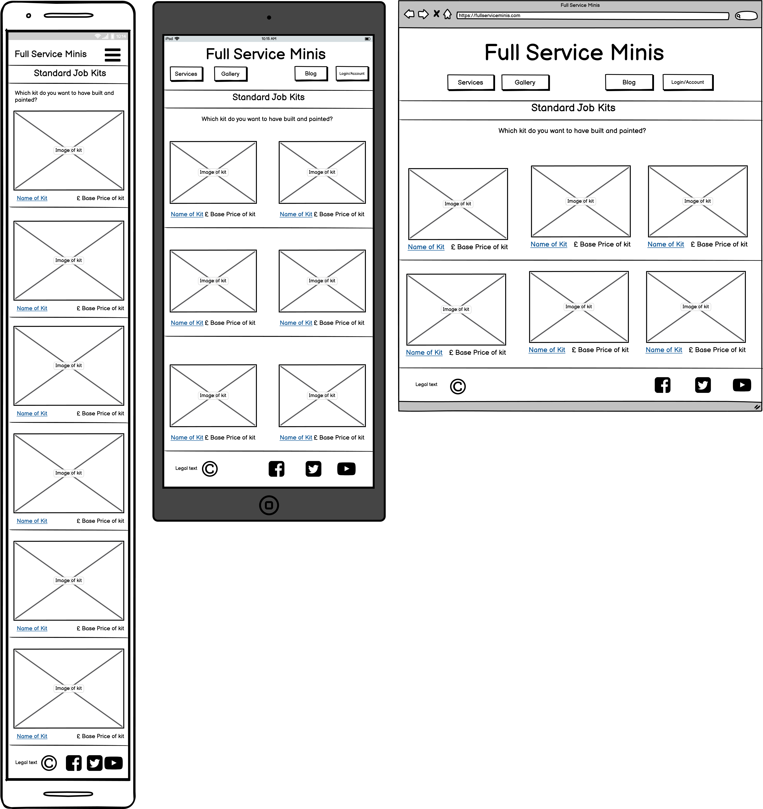
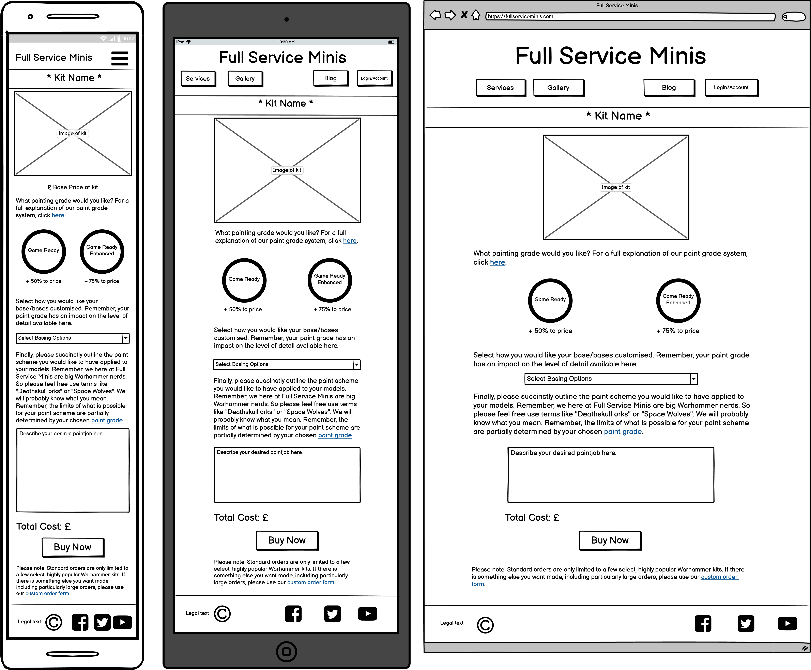
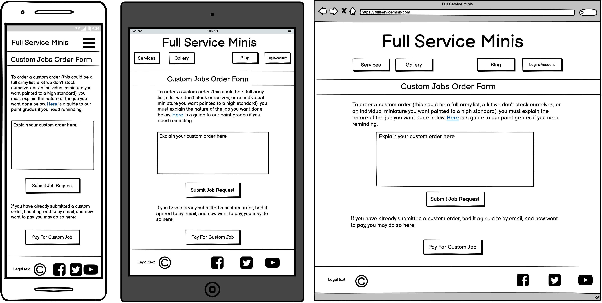
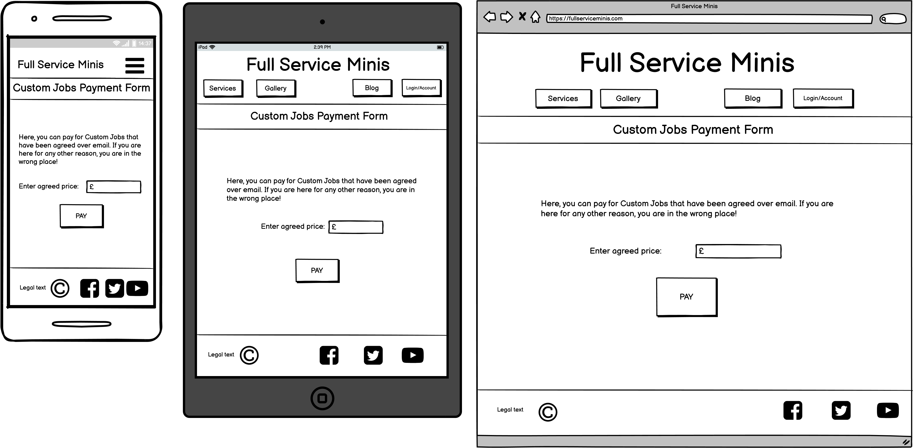
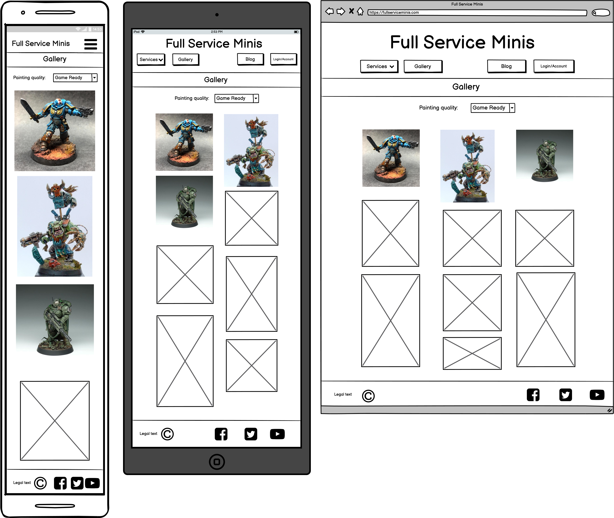
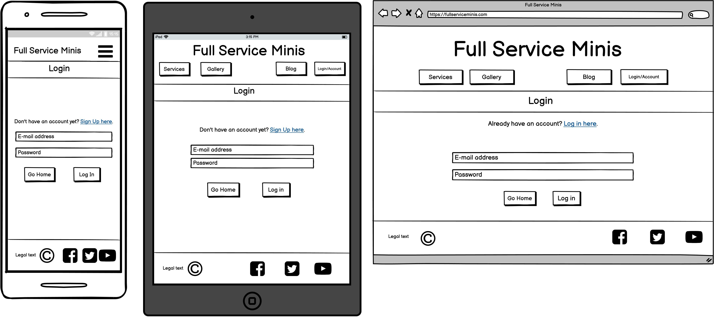
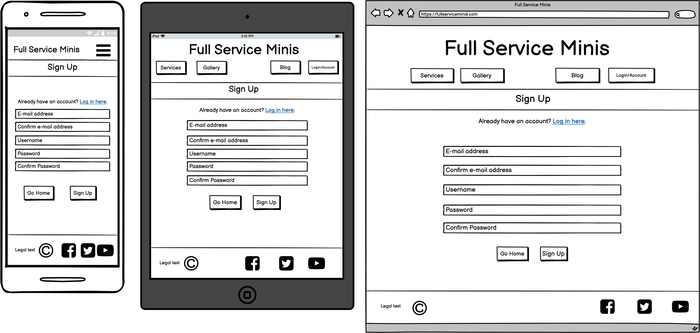
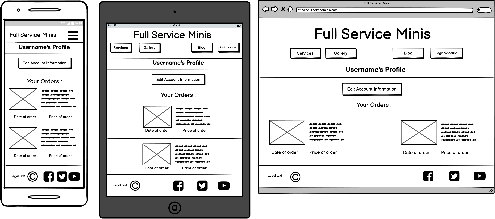

# Full Service Minis Readme

Full Service minis (FSM) will be a fictional site offering a suite of services to miniature wargamers. These services will primarily be focussed around the construction and painting of miniatures. Services offered will include construction and painting of an array of stocked basic kits, from individual minis up to full sized armies, and custom modelling on individual minis. All of the service offerings of Full Service Minis will include a wide range of customisation from kit options to paint jobs. The level of detail applied in the painting section will be a factor that will include scope for customisation. Not all minis need to be display quality, some are just being bought for gaming. As such three tiers of painting quality will be offered on all models: game ready, game ready plus, and custom. Jobs that include a high level of unique or otherwise non-standard features will require detailed discussion between painter and client, in order to ensure that the intended outcome is reached. For these kinds of jobs, custom quality is required.

There are two basic tiers of service offered by FSM: Standard and Custom. 

Standard jobs are for individual Warhammer kits (from a range that the site will stock) that customers want constructed and painted to one of two preset quality levels (Game Ready and Game Ready Enhanced). Customers can select the product they want, then customise it before purchase.

Custom jobs are for customers that want to purchase some or many kits not stocked on the site, or for those that want to get a miniature constructed and painted in a way that doesn’t fit neatly into the other two preset quality levels (Game Ready and Game Ready Enhanced).

## UX

The main function of this site is to provide wargamers with easy access to painted miniatures with relatively little hassle. A secondary function of the site is to allow wargamers to purchase bespoke, highly custom painted miniatures. The site, therefore, needs to clearly explain how a user can complete one, or both, of the two main functions. To this end, we have the services page (the second wireframe), which provides a comprehensive explanation of the products and services offered by the site. 

As the primary goal of the site is to provide wargamers with easy access to painted miniatures with relatively little hassle, there will also be large and obvious links directly from the homepage to the products page.

Below are some wireframe mockups of the sites UX:

### Homepage:

### Services Explanation Page:

### Products Page

### Product Page

### Custom Jobs Order form:

### Custom Jobs Payment page:

### Gallery:

### Login page:

### Sign up:

### Profile:

### Blog:

### User Stories

1. As a site user, I want to be able to:
    1. Understand the purpose of the site.
    1. View the products offered by the site.
    1. View examples of the paint and construction work offered by the site, so I can make an informed decision about becoming a customer. 
    1. Create an account for the site.
    1. Edit my account's information (password, address, etc.)
    1. Keep up to date with the goings on at FSM.

1. As a customer, I want to be able to:
    1. Purchase painted miniatures.
    1. Receive email confirmation of my purchases.
    1. View my purchase history, if I decide to sign up.
    1. Not have to sign up to make a purchase, if I don't want to.
    1. Make enquiries about custom builds.
    1. Find a record of my custom build enquiries on my profile page.
    1. Pay for custom builds, once a price has been agreed upon.
