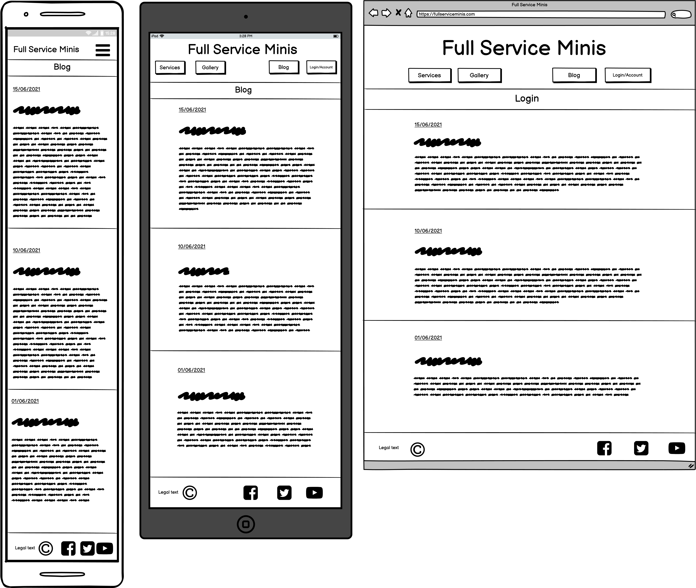

# Full Service Minis Readme

Full Service minis (FSM) will be a fictional site offering a suite of services to miniature wargamers. These services will primarily be focussed around the construction and painting of miniatures. Services offered will include construction and painting of an array of stocked basic kits, from individual minis up to full sized armies, and custom modelling on individual minis. All of the service offerings of Full Service Minis will include a wide range of customisation from kit options to paint jobs. The level of detail applied in the painting section will be a factor that will include scope for customisation. Not all minis need to be display quality, some are just being bought for gaming. As such three tiers of painting quality will be offered on all models: game ready, game ready plus, and custom. Jobs that include a high level of unique or otherwise non-standard features will require detailed discussion between painter and client, in order to ensure that the intended outcome is reached. For these kinds of jobs, custom quality is required.

There are two basic tiers of service offered by FSM: Standard and Custom. 

Standard jobs are for individual Warhammer kits (from a range that the site will stock) that customers want constructed and painted to one of two preset quality levels (Game Ready and Game Ready Enhanced). Customers can select the product they want, then customise it before purchase.

Custom jobs are for customers that want to purchase some or many kits not stocked on the site, or for those that want to get a miniature constructed and painted in a way that doesn’t fit neatly into the other two preset quality levels (Game Ready and Game Ready Enhanced).

## UX

<!-- add proper UX fluff here -->

Below are some wireframe mock ups of the sites UX:

